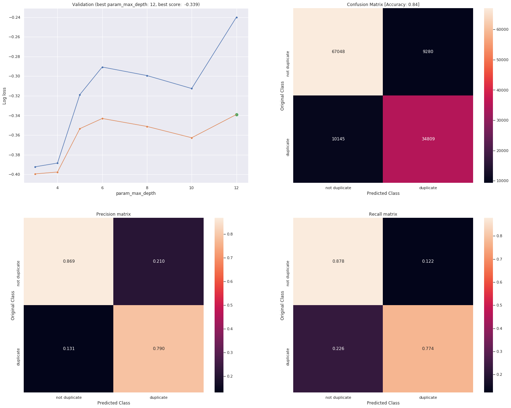

# Quora Question Pairs - Kaggle

Source: https://www.kaggle.com/c/quora-question-pairs

- [Objective](#objective)
  - [Real world/Business Objectives and Constraints¶](#real-worldbusiness-objectives-and-constraints)
- [Data Description](#data-description)
- [Metric](#metric)
- [Feature Extraction](#feature-extraction)
  - [Advanced NLP features (based descriptive stats)](#advanced-nlp-features-based-descriptive-stats)
  - [fuzzy features (based on various similartiy scores)](#fuzzy-features-based-on-various-similartiy-scores)
  - [Distance Metircs (on Word2Vec extracted from Gensim)](#distance-metircs-on-word2vec-extracted-from-gensim)
- [TFIDF Features](#tfidf-features)
- [Best Model](#best-model)
  - [HyperParameters search space](#hyperparameters-search-space)
  - [Validation results](#validation-results)
  - [Calibration on Best Estimator](#calibration-on-best-estimator)
- [Technologies Used](#technologies-used)
- [Credits:](#credits)
- [Creator:](#creator)

## Objective

Quora is a platform to ask questions and connect with people who contribute unique insights and quality answers. Over 100 million people visit Quora every month, so it's no surprise that many people ask similarly worded questions. Multiple questions with the same intent can cause seekers to spend more time finding the best answer to their question, and make writers feel they need to answer multiple versions of the same question.

 If we can identify which questions asked on Quora are duplicates of questions that have already been asked helps us to instantly provide answers to questions that have already been answered. This project focus is to classify whether question pairs are duplicates or not using advanced NLP techniques.


### Real world/Business Objectives and Constraints¶
* The cost of a mis-classification can be very high.
* You would want a probability of a pair of questions to be duplicates so that you can choose any threshold of choice.
* No strict latency concerns.
* Interpretability is partially important.

## Data Description

* id: Looks like a simple rowID
* qid{1, 2}: The unique ID of each question in the pair
* question{1, 2}: The actual textual contents of the questions.
* is_duplicate: The label that we are trying to predict - whether the two questions are duplicates of each other.
* Number of rows in = 404,290

## Metric
Since higher misclassification leads to Customer dissatisfaction (lower precision rate) and consumer disengagement (lower recall rate)

We have to be highly sure about our predictions So probailities of examples belonging to a class seems to be sound metric for our problem. LogLoss metric looks at the probabilities themselves.

* log-loss : LogarithmicLoss (metric we want to optimize for)
* Binary Confusion Matrix (more human intrepretable)


## Feature Extraction

### Advanced NLP features (based descriptive stats)

* **cwc_min** : Ratio of common_word_count to min lenghth of word count of Q1 and Q2
* **cwc_max** : Ratio of common_word_count to max lenghth of word count of Q1 and Q2
* **csc_min** : Ratio of common_stop_count to min lenghth of stop count of Q1 and Q2
* **csc_max** : Ratio of common_stop_count to max lenghth of stop count of Q1 and Q2
* **ctc_min** : Ratio of common_token_count to min lenghth of token count of Q1 and Q2
* **ctc_max** : Ratio of common_token_count to max lenghth of token count of Q1 and Q2
* **last_word_eq** : Check if First word of both questions is equal or not
* **first_word_eq** : Check if First word of both questions is equal or not
* **abs_len_diff** : Abs. length difference
* **mean_len** : Average Token Length of both Questions

### fuzzy features (based on various similartiy scores)

- **fuzz ratio**
- **fuzz partial ratio**
- **token sort ratio**
- **token set ratio**

### Distance Metircs (on Word2Vec extracted from Gensim)

* Word mover distance
* Normalized word mover distance
* Cosine distance between vectors of question1 and question2
* Manhattan distance between vectors of question1 and question2
* Jaccard similarity between vectors of question1 and question2
* Canberra distance between vectors of question1 and question2
* Euclidean distance between vectors of question1 and question2
* Minkowski distance between vectors of question1 and question2
* Braycurtis distance between vectors of question1 and question2
* Skew of vector for question1
* Skew of vector for question2
* Kurtosis of vector for question1
* Kurtosis of vector for question2

## TFIDF Features
- TF-IDF 
- TF-IDF wegihted Word2Vec features

## Best Model
Trained various models like Logistic Regressin, SVM and XGBoost with hyperparameter tuning to select best model. **XGBoost** turns out be best model with highest accuracy of **84%**.
 

``` py
clf = Pipeline([
    ('features',FeatureUnion([
        ('nlp_features',DF_NLP_extract()),
        ('nlp_stats_features',NLP_TextStats()),
        ('fuzzy_features',DF_fuzzySimExtract()),
        ('NLP_Dist_features',NLP_DistMetrics(gensim_model = gen_model,verbose = True)),
        ('TFIDF_vectorizer',Pipeline([ 
            ('combine',Converter()),
            ('TFIDF_wv_features',TfidfVectorizer(ngram_range=(1,2)))]))
        ]))])
```

### HyperParameters search space
``` py
param_grid = {
    "n_estimators": [100, 150, 250, 500],
    "learning_rate": [0.05, 0.10, 0.15, 0.20, 0.25, 0.30],
    "max_depth": [3, 4, 5, 6, 8, 10, 12, 15],
    "min_child_weight": [1, 3, 5, 7],
    "gamma": [0.0, 0.1, 0.2, 0.3, 0.4],
    "colsample_bytree": [0.3, 0.4, 0.5, 0.7],
    'eta': [0.1, 0.2, 0.3]
}
```

### Validation results



### Calibration on Best Estimator

``` py
{'n_estimators': 500,
  'min_child_weight': 1,
  'max_depth': 15,
  'learning_rate': 0.25,
  'gamma': 0.2,
  'eta': 0.1,
  'colsample_bytree': 0.4}
```
## Technologies Used


[](https://scikit-learn.org/stable/#)
[](https://radimrehurek.com/gensim/models/word2vec.html)
[](https://scikit-learn.org/stable/#)


</br>

## Credits:
* FuzzyWuzzy -  https://github.com/seatgeek/fuzzywuzzy#usage
* fuzzywuzzy features description - http://chairnerd.seatgeek.com/fuzzywuzzy-fuzzy-string-matching-in-python/
* Is That a Duplicate Quora Question? - https://www.linkedin.com/pulse/duplicate-quora-question-abhishek-thakur/


</br>

------
## Creator:
[](https://skumar-djangoblog.herokuapp.com/)
